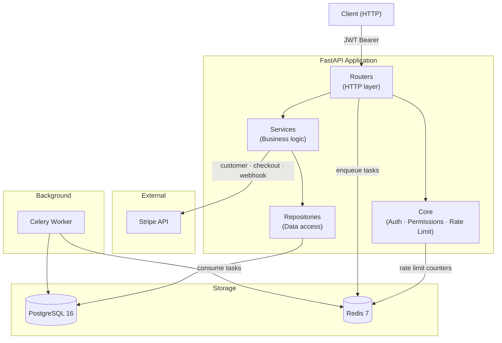
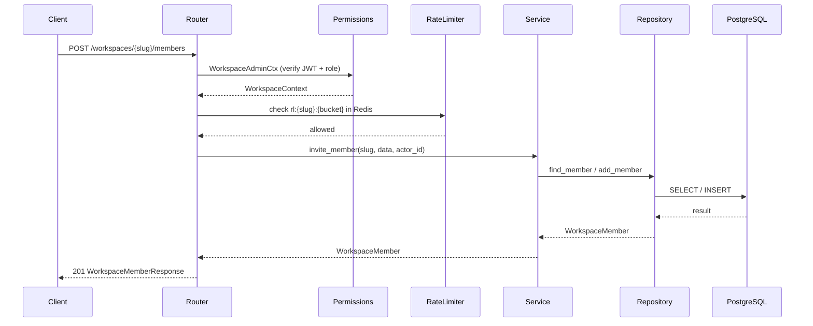

# Multi-Tenant SaaS Starter API


A production-ready multi-tenant SaaS backend boilerplate built with FastAPI, SQLAlchemy 2.0, and PostgreSQL. Built as a portfolio project demonstrating layered architecture, RBAC, Stripe billing, async background tasks, and Redis-based rate limiting.

---

## Architecture



### Request flow



---

## Tech Stack

| Layer | Technology |
|-------|-----------|
| Framework | FastAPI 0.115 (async) |
| ORM | SQLAlchemy 2.0 (async) + asyncpg |
| Database | PostgreSQL 16 |
| Migrations | Alembic |
| Auth | PyJWT + bcrypt |
| Background tasks | Celery 5 + Redis |
| Rate limiting | Redis (fixed window) |
| Billing | Stripe SDK |
| Validation | Pydantic v2 |
| Testing | pytest + pytest-asyncio |
| Linting | Ruff |
| Type checking | mypy (strict) |
| Packaging | uv |
| Containerisation | Docker + Docker Compose |

---

## Features

- **Multi-tenant workspaces** — slug-based tenant isolation, workspace CRUD, member management
- **RBAC** — `owner / admin / member` roles enforced via FastAPI dependency guards
- **JWT auth** — access (15 min) + refresh (7 day) token pair, bcrypt password hashing
- **Stripe billing** — Stripe customer creation, hosted checkout sessions, webhook handler for `subscription.updated` / `subscription.deleted`
- **Celery workers** — welcome email and workspace report background tasks
- **Per-tenant rate limiting** — Redis fixed-window counter scoped to workspace slug
- **78% test coverage** — unit tests for services, repositories, auth, schemas, rate limiter, and workers
- **GitHub Actions CI** — parallel lint (ruff), type check (mypy), and test jobs on every push

---

## Quick Start

### Prerequisites

- Docker + Docker Compose
- A Stripe account (for billing features)

### 1. Clone and configure

```bash
git clone https://github.com/rizkimul/multitenan-saas-starter-API.git
cd multitenan-saas-starter-API
cp .env.example .env   # then fill in values
```

`.env` required values:

```env
POSTGRES_USER=saas
POSTGRES_PASSWORD=saas
POSTGRES_DB=saas
SECRET_KEY=your-secret-key-min-32-chars
STRIPE_SECRET_KEY=sk_test_...
STRIPE_WEBHOOK_SECRET=whsec_...
STRIPE_PRICE_ID=price_...
```

### 2. Start the stack

```bash
docker compose up
```

This starts: PostgreSQL, Redis, FastAPI app (port 8000), and Celery worker.

### 3. Apply migrations

```bash
docker compose run --rm app alembic upgrade head
```

### 4. Explore the API

Interactive docs: [http://localhost:8000/docs](http://localhost:8000/docs)

---

## API Reference

### Auth

| Method | Endpoint | Description |
|--------|----------|-------------|
| `POST` | `/auth/register` | Register a new user |
| `POST` | `/auth/login` | Login, returns JWT pair |
| `POST` | `/auth/refresh` | Refresh access token |
| `GET` | `/auth/me` | Get current user |

### Workspaces

| Method | Endpoint | Auth | Description |
|--------|----------|------|-------------|
| `POST` | `/workspaces` | Any | Create workspace |
| `GET` | `/workspaces` | Any | List user's workspaces |
| `GET` | `/workspaces/{slug}` | Member+ | Get workspace detail |
| `POST` | `/workspaces/{slug}/members` | Admin+ | Invite member |
| `PATCH` | `/workspaces/{slug}/members/{user_id}` | Owner | Update member role |
| `DELETE` | `/workspaces/{slug}/members/{user_id}` | Member+ | Remove member |

### Billing

| Method | Endpoint | Auth | Description |
|--------|----------|------|-------------|
| `POST` | `/workspaces/{slug}/billing/setup` | Admin+ | Create Stripe customer |
| `POST` | `/workspaces/{slug}/billing/checkout` | Admin+ | Start Stripe checkout |
| `GET` | `/workspaces/{slug}/billing` | Member+ | Get subscription status |
| `POST` | `/billing/webhook` | None (Stripe signature) | Stripe webhook handler |

---

## Project Structure

```
app/
├── core/           # Cross-cutting concerns
│   ├── auth.py         # JWT dependency (get_current_user)
│   ├── config.py       # Pydantic Settings (12-factor)
│   ├── db.py           # Async SQLAlchemy engine + session
│   ├── exceptions.py   # AppError hierarchy
│   ├── permissions.py  # RBAC dependency factory
│   ├── rate_limit.py   # Redis fixed-window rate limiter
│   └── redis.py        # Async Redis client
├── models/         # SQLAlchemy ORM models
├── repositories/   # Data access layer (all queries live here)
├── routers/        # HTTP layer (request/response only)
├── schemas/        # Pydantic DTOs
├── services/       # Business logic + orchestration
└── workers/        # Celery app + tasks
    └── tasks/
        ├── email.py    # Welcome + subscription emails
        └── report.py   # Workspace usage report
tests/
└── unit/           # Full unit test suite (78% coverage)
```

---

## Key Design Patterns

**Layered architecture** — Routers never touch models or sessions directly. Services never import SQLAlchemy. Repositories accept primitives, never Pydantic schemas.

**Repository pattern** — All SQL queries live in `repositories/`. Services call repo methods; repos call the session. Swappable for testing.

**Dependency injection** — FastAPI's `Depends()` wires auth, DB sessions, rate limiting, and RBAC guards declaratively in route signatures.

**Async-first** — All I/O is async (asyncpg, redis.asyncio). Celery tasks bridge to async via `asyncio.run()`.

**Stripe local mirror** — Subscription state is stored locally and synced via webhooks. Access checks read the DB, never Stripe's API.

---

## Development

```bash
# Run tests with coverage
docker compose run --rm app pytest tests/unit/ -v --cov=app --cov-report=term-missing

# Generate a migration
docker compose run --rm app alembic revision --autogenerate -m "description"

# Apply migrations
docker compose run --rm app alembic upgrade head

# Lint
docker compose run --rm app ruff check app tests

# Type check
docker compose run --rm app mypy app
```
